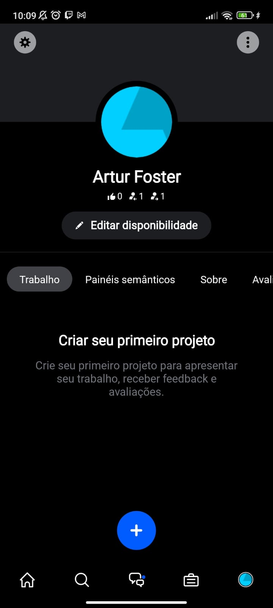
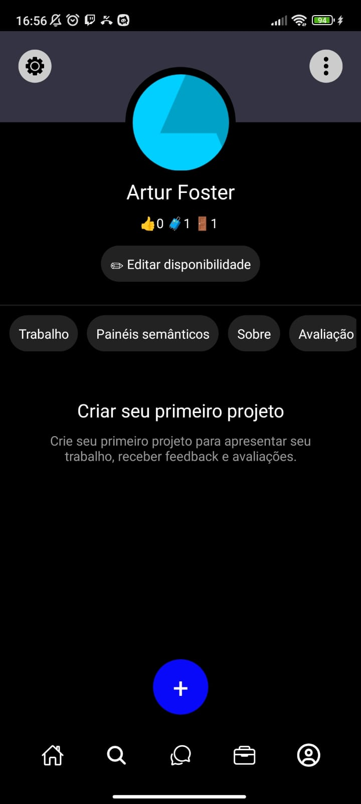

# P1-react-native
  Primeira atividade de react-native
## Clone App Screen
  O trabalho consiste em fazer um clone de uma tela de algum aplicativo. No meu caso da aba perfil do app Behance   
### Referencias

  

### Minha Versão

  

